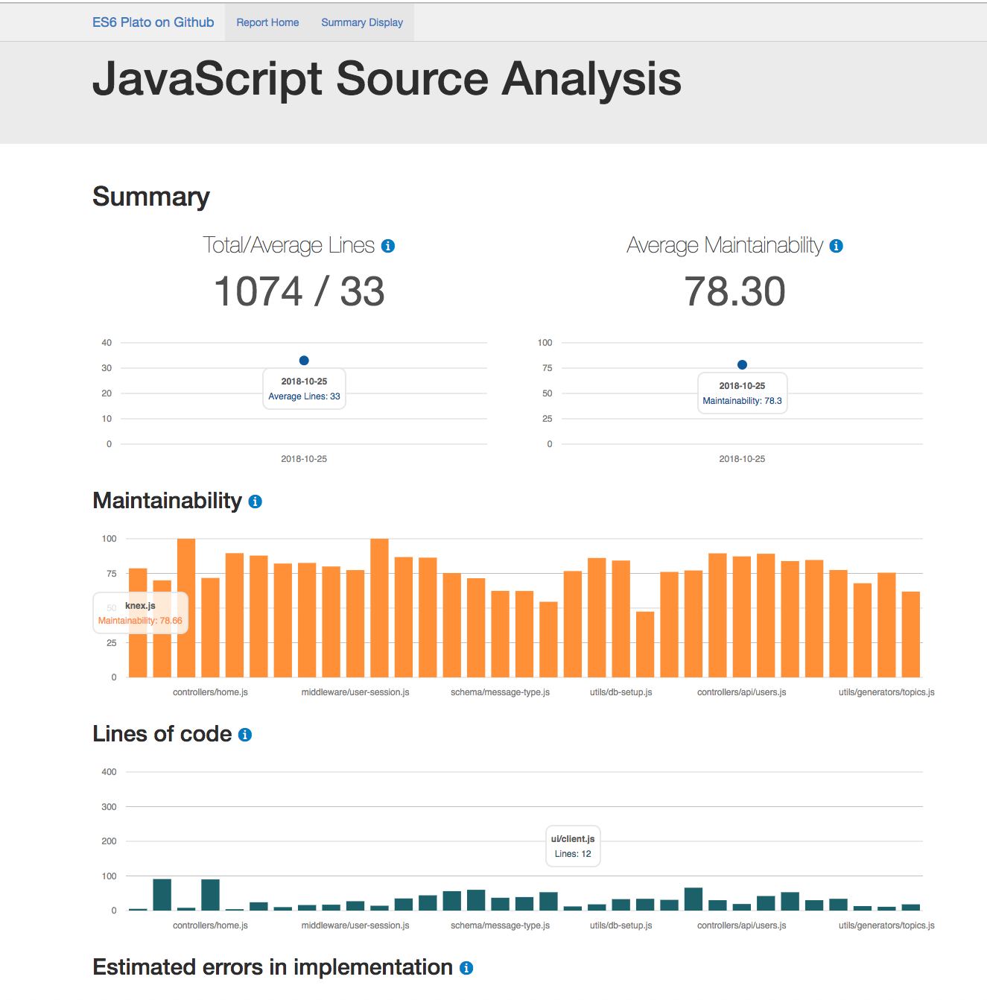

import { Head } from 'mdx-deck'

import { future  } from 'mdx-deck/themes'

import { CodeSurfer } from "mdx-deck-code-surfer"
import { dark } from "mdx-deck/themes"
import nightOwl from "prism-react-renderer/themes/nightOwl"

export { components } from "mdx-deck-code-surfer"
export const theme = {
  ...dark,
  codeSurfer: {
    ...nightOwl,
    showNumbers: false
  }
}

<Head>
  <title>More Betterer @ Auckland Node.JS</title>
</Head>

# Aukland Node.JS Meetup
---

# More Betterer
### Bringing order to a chaotic codebase
---

# Who is this guy?

---

# Senior Engineer @ Lightbox
<svg viewBox="0 0 1029 327" xmlns="http://www.w3.org/2000/svg">
  <g stroke="none" strokeWidth="1" fill="none" fillRule="evenodd">
    <rect
      id="Rectangle-path"
      stroke="#000000"
      fill="#FFFFFF"
      x="11"
      y="10"
      width="1006"
      height="306"
    />
    <path
      d="M0,0 L0,326.034 L1028.463,326.034 L1028.463,0 L0,0 L0,0 Z M1007.18,304.753 L21.282,304.753 L21.282,21.285 L1007.179,21.285 L1007.179,304.753 L1007.18,304.753 Z M86.768,239.265 L86.768,86.771 L119.511,86.771 L119.511,211.102 L169.657,211.102 L169.657,239.266 L86.768,239.266 L86.768,239.265 Z M189.302,239.265 L189.302,86.771 L222.045,86.771 L222.045,239.266 L189.302,239.266 L189.302,239.265 Z M342.931,138.632 L342.931,127.91 C342.931,104.099 326.444,83.721 293.931,83.721 C261.417,83.721 243.328,105.243 243.328,127.91 L243.328,198.124 C243.328,220.792 261.417,242.313 293.931,242.313 C326.444,242.313 342.931,221.934 342.931,198.124 L342.931,160.841 L293.474,160.841 L293.474,183.28 L311.332,183.28 L311.332,199.042 C311.332,207.513 306.295,214.839 294.158,214.839 C282.252,214.839 276.528,207.054 276.528,198.581 L276.528,127.451 C276.528,118.98 282.253,111.194 294.158,111.194 C306.295,111.194 311.332,118.521 311.332,126.992 L311.332,138.632 L342.931,138.632 L342.931,138.632 Z M434.965,239.265 L434.965,178.128 L396.958,178.128 L396.958,239.265 L364.213,239.265 L364.213,86.771 L396.958,86.771 L396.958,149.963 L434.965,149.963 L434.965,86.771 L467.71,86.771 L467.71,239.266 L434.965,239.266 L434.965,239.265 Z M553.067,114.704 L553.067,239.266 L520.327,239.266 L520.327,114.704 L487.354,114.704 L487.354,86.771 L585.81,86.771 L585.81,114.704 L553.067,114.704 L553.067,114.704 Z M662.014,239.265 L605.458,239.265 L605.458,86.771 L661.328,86.771 C686.056,86.771 699.565,100.05 699.565,121.804 L699.565,132.795 C699.565,147.217 693.839,158.44 678.268,161.187 C694.526,164.619 700.48,175.383 700.48,189.578 L700.48,204.232 C700.482,226.212 686.742,239.265 662.014,239.265 L662.014,239.265 Z M668.424,124.777 C668.424,117.223 665.219,112.416 656.748,112.416 L638.43,112.416 L638.43,151.339 L655.373,151.339 C663.848,151.339 668.425,146.989 668.425,138.061 L668.424,124.777 L668.424,124.777 Z M669.114,187.517 C669.114,178.585 664.534,174.005 656.06,174.005 L638.43,174.005 L638.43,213.618 L657.433,213.618 C665.905,213.618 669.114,209.038 669.114,201.483 L669.114,187.514 L669.115,187.514 L669.115,187.517 L669.114,187.517 Z M770.995,242.314 C739.626,242.314 720.849,222.853 720.849,195.605 L720.849,130.2 C720.849,103.184 739.625,83.722 770.995,83.722 C802.592,83.722 821.141,103.184 821.141,130.2 L821.141,195.605 C821.14,222.853 802.591,242.314 770.995,242.314 L770.995,242.314 Z M788.168,128.369 C788.168,118.064 781.985,111.195 770.994,111.195 C760.23,111.195 754.048,118.064 754.048,128.369 L754.048,197.439 C754.048,207.74 760.232,214.609 770.994,214.609 C781.985,214.609 788.168,207.74 788.168,197.439 L788.168,128.369 L788.168,128.369 Z M906.521,239.265 L885.689,186.829 L863.017,239.265 L830.962,239.265 L867.597,161.871 L833.25,86.77 L867.597,86.77 L887.059,137.829 L908.353,86.77 L940.639,86.77 L905.15,160.041 L941.093,239.265 L906.521,239.265 L906.521,239.265 Z"
      id="Shape"
      fill="#000000"
    />
  </g>
</svg>

---
## New Job

 {
      this.onerror=null;
      this.src='https://i.giphy.com/ZFTKZ8zwj38gE.gif';
    }}
    alt="" />

## Day 1

---

## And then

 {
      this.onerror=null;
      this.src='https://i.giphy.com/h56b7ZOGJngsw.gif';
    }}
    alt="" />

## You see the code

---

 {
      this.onerror=null;
      this.src='https://i.giphy.com/l3vRbr9qymy9A4120.gif';
    }}
alt="" />

---

## Remember, it could be worse.

---

## It could be .Net

 {
      this.onerror=null;
      this.src='https://i.giphy.com/cQtlhD48EG0SY.gif';
    }}
    alt="" />

---

## Let's starting exploring

 {
      this.onerror=null;
      this.src='https://i.giphy.com/1dIX9z9iGip0v3Cn9H.gif';
    }}
alt="" />

---

## First Stop
## package.json

---

<CodeSurfer
  title="Scripts"
  code={JSON.stringify(require("./samples/package.scripts.json"), null, 2)}
  steps={[
    { notes: "Use ⬆️ and ⬇️ keys" },
    { lines: [3], notes: "Start the app in dev mode" },
    { lines: [5, 6, 7], notes: "run the tests and pre and post actions" }
  ]}
/>

---

<CodeSurfer
  title="Dependencies"
  code={JSON.stringify(require("./samples/package.deps.json"), null, 2)}
  steps={[
    { notes: "Use ⬆️ and ⬇️ keys" },
    { lines: [14], notes: "Express" },
    { lines: [6, 24, 25], notes: "The ORM and database dependencies" }
  ]}
/>

---
## What else?

* engines (What versions of node and npm it supports)
* Jest
* Babel
* Browserify
* ???

---

## Configuration

Look for `process.env.` or JSON files

---

## Database
### Migrations?

---

## Routes

---
<CodeSurfer
  title="Routes Testing"
  code={require("!raw-loader!./samples/routes-test.js")}
  steps={[
    { notes: "Use ⬆️ and ⬇️ keys" },
    { lines: [8], notes: "Get app routes object" },
    { lines: [10], notes: "Verify against a snapshot" }
  ]}
/>
---

## Tests

---

  {
      this.onerror=null;
      this.src='https://i.giphy.com/NaA840F7VJSHS.gif';
    }}
    alt="" />
---

## Establish baselines

---

<CodeSurfer
  title="Routes Testing"
  code={require("!raw-loader!./samples/tests.js")}
  steps={[
    { notes: "Use ⬆️ and ⬇️ keys" },
    { lines: [1], notes: "Supertest" },
    { lines: [12], notes: "Pass in the express app" },
    { lines: [13], notes: "Post to the route" },
    { lines: [14], notes: "Pass in the data" },
    { lines: [15, 17], notes: "Expected results" }
  ]}
/>

---

### Quality Analysis
 

---

### Route response times

---

### Tools

 * <a href="https://www.npmjs.com/package/es6-plato">ES6-Plato</a>
 * <a href="https://www.npmjs.com/package/eslint-plugin-sonarjs">ESLint Plugin for SonarJS</a>
 * <a href="https://www.sonarsource.com/">SonarSource</a>
 * <a href="https://www.npmjs.com/package/server-timing">Server Timing middleware</a>
 * <a href="http://uptimerobot.com/">Uptime Robot</a>

---

## Monitoring

* Response times
* Resources
* "Golden" Routes

---

## Incremental Change

The mess didn't happen overnight, you can't be expected to solve it immediately

---

# THANKS

* <a href="https://twitter.com/kev_nz">@kev_nz on Twitter</a>
* <a href="https://github.com/Kevnz">@kevnz on GitHub</a>